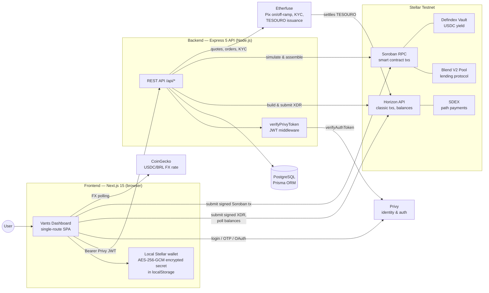
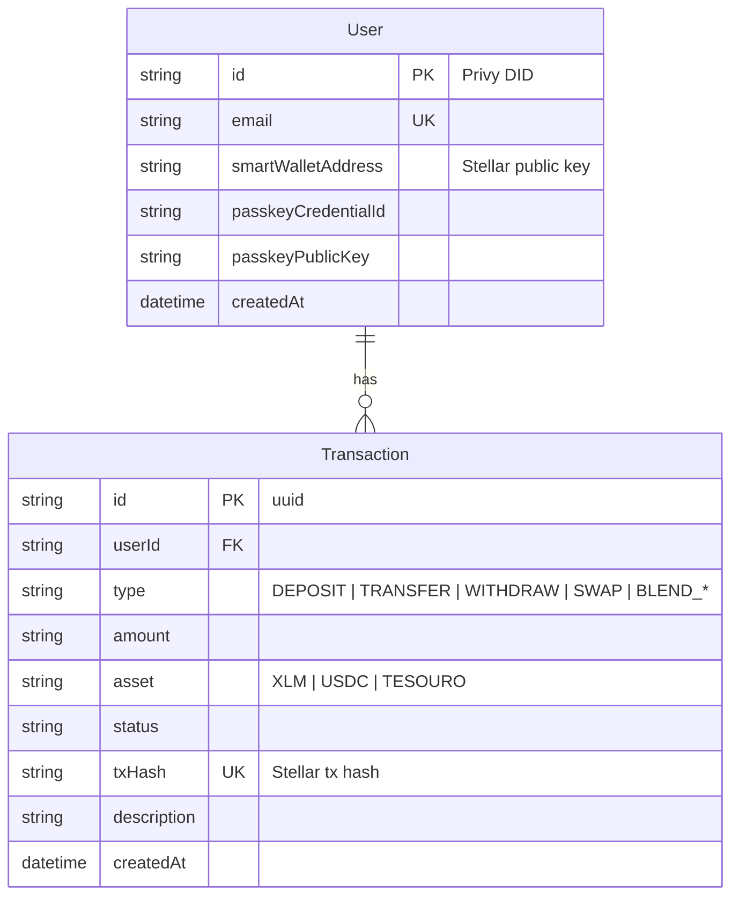
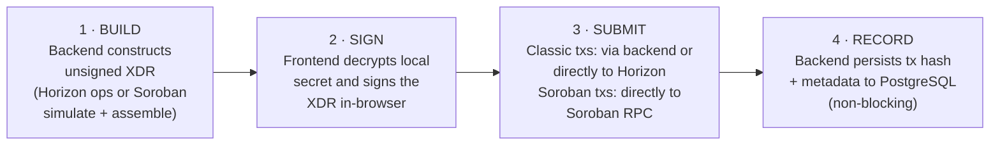
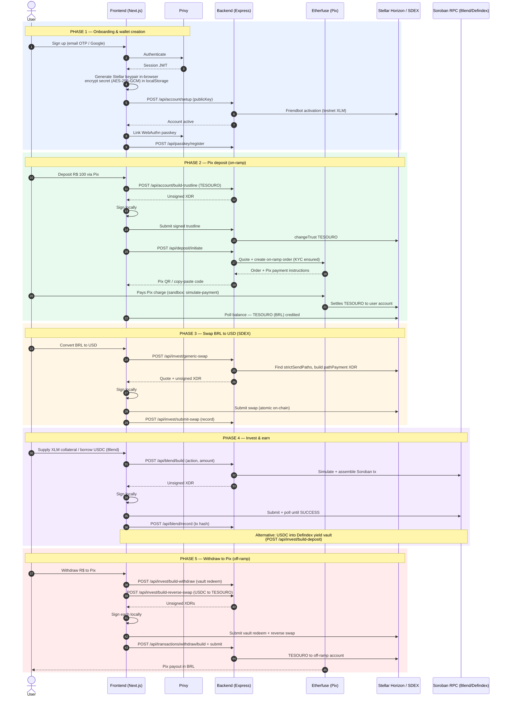
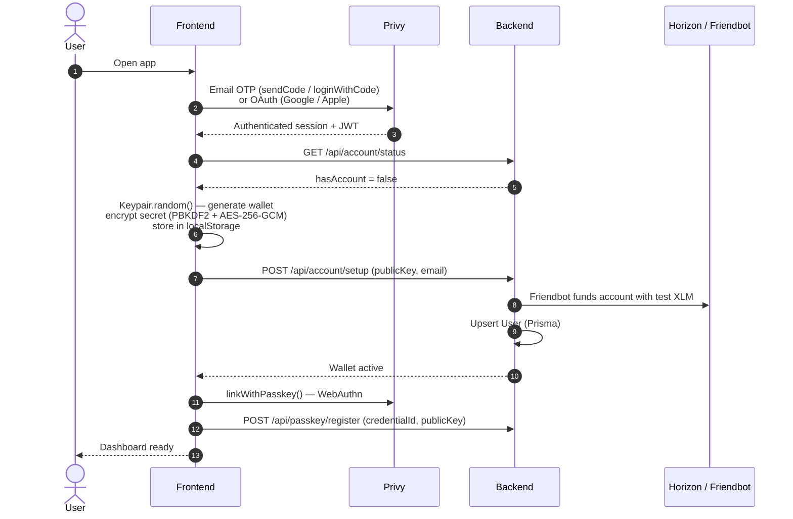
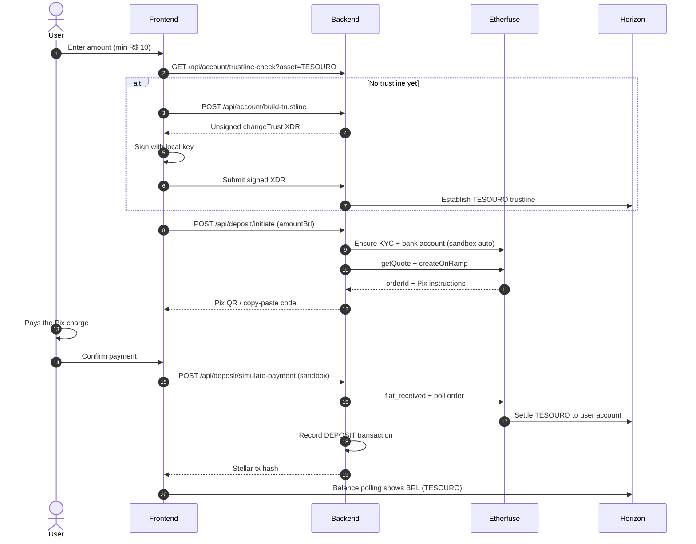
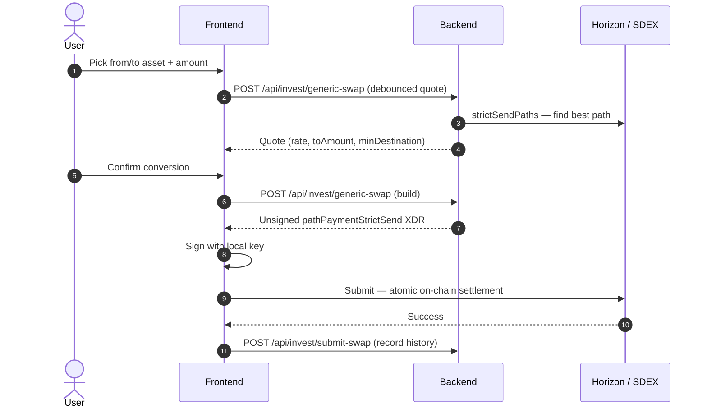
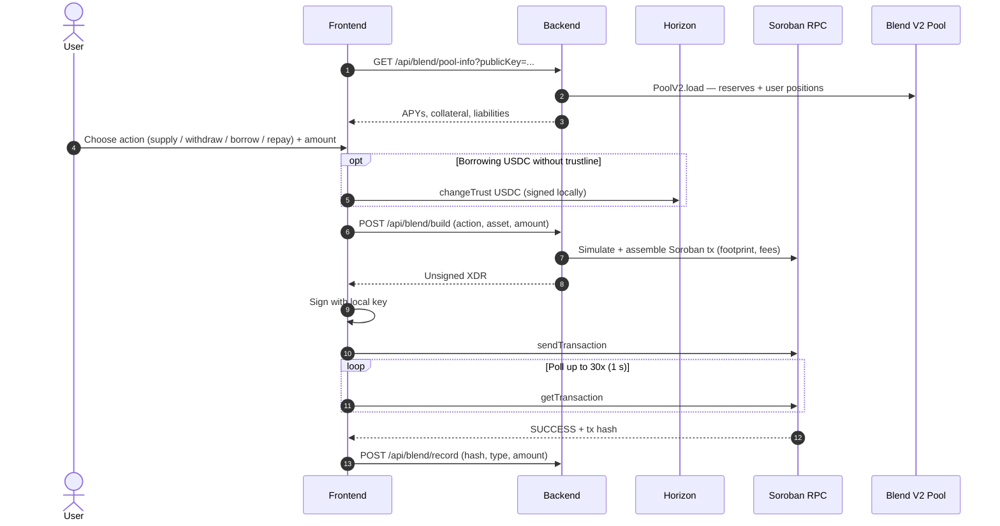
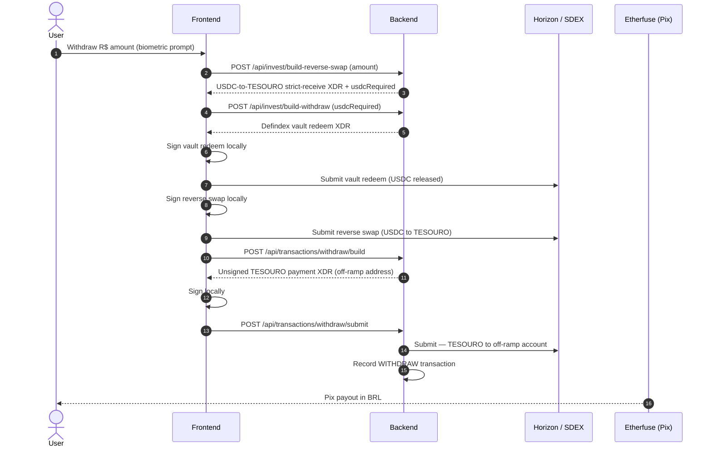

# Vants — Technical Architecture

> **Vants** is a non-custodial financial app built on **Stellar** that lets Brazilian users move from Pix (BRL) into tokenized assets, swap on the Stellar DEX, earn yield, borrow against collateral, and cash back out to Pix — all without the platform ever holding user keys or funds.
>
> **Network:** Stellar **Testnet** (Etherfuse sandbox for fiat rails). All addresses, pools, and rails in this document are testnet/sandbox instances of the production-equivalent services.

---

## Table of Contents

1. [Overview & System Context](#1-overview--system-context)
2. [Tech Stack](#2-tech-stack)
3. [Architecture Layers & Key Modules](#3-architecture-layers--key-modules)
4. [Security & Custody Model](#4-security--custody-model)
5. [API Reference](#5-api-reference)
6. [External Integrations](#6-external-integrations)
7. [End-to-End Flow (E2E)](#7-end-to-end-flow-e2e)
8. [Environment & Configuration](#8-environment--configuration)
9. [Known Limitations & Roadmap Notes](#9-known-limitations--roadmap-notes)

---

## 1. Overview & System Context

Vants implements the loop **Deposit → Invest → Earn → Pay**:

1. **On-ramp (Pix → chain):** the user pays a Pix charge in BRL; **Etherfuse** settles the equivalent amount of **TESOURO** (tokenized Brazilian Treasury / BRL representation) to the user's Stellar account.
2. **Swap:** TESOURO ↔ USDC ↔ XLM conversions are executed as **path payments on the Stellar DEX (SDEX)** — no custodial exchange involved.
3. **Earn:** USDC can be deposited into a **Defindex** yield vault; XLM can be supplied as collateral to the **Blend** lending protocol (Soroban), enabling USDC borrowing.
4. **Off-ramp (chain → Pix):** positions are unwound (vault redeem → reverse swap → withdraw), and BRL is paid out via Pix.

The platform is **fully non-custodial**: the backend only *builds* unsigned transactions; every transaction is *signed in the user's browser* with a locally-held Stellar keypair.

### System Context Diagram



---

## 2. Tech Stack

The repository is an **npm-workspaces monorepo** ([package.json](package.json)) with two workspaces: `frontend` and `backend`.

| Layer | Technology | Notes |
|---|---|---|
| **Frontend framework** | Next.js `15.3.1` (App Router) + React `19` + TypeScript | Single route: [frontend/app/page.tsx](frontend/app/page.tsx) renders `<VantsDashboard />`; screen switching is local React state in [frontend/components/vants/dashboard.tsx](frontend/components/vants/dashboard.tsx) |
| **UI / styling** | Tailwind CSS v4, Radix UI primitives (shadcn/ui style), lucide-react | Design tokens (`--vants-*`) documented in [DESIGN.md](DESIGN.md) |
| **Auth (client)** | `@privy-io/react-auth` | Email OTP + Google/Apple OAuth. **Embedded wallets disabled** — Privy is identity only |
| **Chain SDK (client)** | `@stellar/stellar-sdk` `^15` | Key generation, local signing, direct Horizon/Soroban submission |
| **Backend framework** | Node.js + Express `5`, TypeScript | Entry point [backend/src/index.ts](backend/src/index.ts); CORS allow-list, 50 kb JSON body limit |
| **Auth (server)** | `@privy-io/server-auth` | JWT verification middleware |
| **Database** | PostgreSQL (Neon) + Prisma `7` (`@prisma/adapter-pg`) | Schema: [backend/prisma/schema.prisma](backend/prisma/schema.prisma) |
| **DeFi SDKs (server)** | `@blend-capital/blend-sdk` `^3.2`, `@defindex/sdk` `^0.3` | Blend lending pool + Defindex yield vault transaction builders |
| **Fiat rails** | Etherfuse REST API (sandbox) | Pix (BRL) on/off-ramp, KYC, TESOURO tokenization |

---

## 3. Architecture Layers & Key Modules

### 3.1 Frontend (`frontend/`)

| Module | Path | Responsibility |
|---|---|---|
| Dashboard orchestrator | [frontend/components/vants/dashboard.tsx](frontend/components/vants/dashboard.tsx) | Auth gating (login → passkey setup → app), bottom-nav view switching, Horizon balance polling (2 s), CoinGecko FX polling (60 s) |
| Onboarding / wallet creation | [frontend/components/vants/PasskeySetup.tsx](frontend/components/vants/PasskeySetup.tsx) | Generates Stellar keypair in-browser, encrypts and stores secret, triggers Friendbot activation, links WebAuthn passkey |
| Pix deposit flow | [frontend/components/vants/deposit-flow.tsx](frontend/components/vants/deposit-flow.tsx) | Amount → trustline → Pix payment → confirmation |
| Swap flow | [frontend/components/vants/convert-flow.tsx](frontend/components/vants/convert-flow.tsx) | BRL/USD/XLM conversion via SDEX with debounced quotes |
| Lending flow | [frontend/components/vants/blend-flow.tsx](frontend/components/vants/blend-flow.tsx) | Blend supply / withdraw / borrow / repay (Soroban) |
| Withdrawal flow | [frontend/components/vants/withdraw-flow.tsx](frontend/components/vants/withdraw-flow.tsx) | Vault redeem → reverse swap → Pix off-ramp |
| Peer transfer | [frontend/components/vants/transfer-view.tsx](frontend/components/vants/transfer-view.tsx) | USDC payment to another Stellar address |
| Wallet crypto utils | [frontend/lib/cryptoUtils.ts](frontend/lib/cryptoUtils.ts) | AES-256-GCM encrypt/decrypt of the Stellar secret (WebCrypto, PBKDF2 100k iterations) |
| API config | [frontend/lib/config.ts](frontend/lib/config.ts) | Backend base URL (`NEXT_PUBLIC_BACKEND_URL`, default `http://localhost:4000`) |
| Providers | [frontend/app/layout.tsx](frontend/app/layout.tsx) | `LanguageProvider → ThemeProvider → PrivyProviderWrapper` |

### 3.2 Backend (`backend/src/`)

| Module | Path | Responsibility |
|---|---|---|
| Server bootstrap | [backend/src/index.ts](backend/src/index.ts) | Express app, CORS, route mounting, `/health`, `/debug/env` |
| Auth middleware | [backend/src/middleware/verifyPrivyToken.ts](backend/src/middleware/verifyPrivyToken.ts) | Validates `Authorization: Bearer <Privy JWT>`, injects `req.user.id` |
| Account routes | [backend/src/routes/accountRoutes.ts](backend/src/routes/accountRoutes.ts) | Wallet activation (Friendbot), trustlines, status, balance |
| Transaction routes | [backend/src/routes/transactionRoutes.ts](backend/src/routes/transactionRoutes.ts) | History, USDC transfer build/submit, Pix withdraw build/submit |
| Passkey routes | [backend/src/routes/passkeyRoutes.ts](backend/src/routes/passkeyRoutes.ts) | WebAuthn credential persistence |
| Deposit routes | [backend/src/routes/depositRoutes.ts](backend/src/routes/depositRoutes.ts) | Etherfuse Pix on-ramp (quote, order, sandbox settlement) |
| Invest routes | [backend/src/routes/investRoutes.ts](backend/src/routes/investRoutes.ts) | SDEX swaps (generic, reverse), Defindex vault deposit/withdraw, vault info |
| Blend routes | [backend/src/routes/blendRoutes.ts](backend/src/routes/blendRoutes.ts) | Pool info, Soroban tx builder, tx recording |
| Stellar service | [backend/src/services/stellarService.ts](backend/src/services/stellarService.ts) | Horizon operations: activation, submit signed XDR, balances, trustlines, payment builders |
| Etherfuse services | [backend/src/services/etherfuse/](backend/src/services/etherfuse/) | REST client (`client.ts`), provider-agnostic `Anchor` interface (`types.ts`), SDEX swap builders (`swapService.ts`) |
| Blend services | [backend/src/services/blend/](backend/src/services/blend/) | Pool config, position reader, supply/withdraw/borrow/repay XDR builder (simulated via Soroban RPC) |
| Defindex services | [backend/src/services/defindex/](backend/src/services/defindex/) | Vault deposit/withdraw XDR builders, APY & balance readers |
| Prisma client | [backend/src/lib/prisma.ts](backend/src/lib/prisma.ts) | Singleton over `pg` Pool |

### 3.3 Data Model



The database intentionally stores **no keys and no balances** — balances are always read live from Horizon; the DB is only identity linkage + human-readable activity history.

---

## 4. Security & Custody Model

**Vants is non-custodial.** The backend never sees, stores, or transports a user private key.

### Key lifecycle (client-side)

1. **Generation** — during onboarding, `Keypair.random()` runs **in the browser** ([PasskeySetup.tsx](frontend/components/vants/PasskeySetup.tsx)).
2. **Encryption at rest** — the secret seed is encrypted with **AES-256-GCM** using a key derived via **PBKDF2 (100,000 iterations, SHA-256)** from the Privy user ID plus a random 16-byte salt; ciphertext (`salt + IV + ciphertext`, base64) is stored in `localStorage`, namespaced per user ([frontend/lib/cryptoUtils.ts](frontend/lib/cryptoUtils.ts)).
3. **Signing** — before every money movement the secret is decrypted in memory, used with `Keypair.fromSecret().sign(tx)`, and discarded.
4. **Server-side keys** — the backend holds only a **testnet mock-asset issuer key** (`ISSUER_SECRET_KEY`); no user funds are ever controlled by server keys.

### Transaction pattern: Build → Sign → Submit



### Authentication & authorization

- **Identity:** Privy (email OTP, Google/Apple OAuth). Embedded wallets are explicitly **off** (`createOnLogin: 'off'` in [PrivyProviderWrapper.tsx](frontend/components/providers/PrivyProviderWrapper.tsx)) — Privy issues the session JWT, nothing more.
- **API auth:** every protected endpoint runs [verifyPrivyToken](backend/src/middleware/verifyPrivyToken.ts), which validates the Bearer token with `privy.verifyAuthToken()` and scopes all DB access to the resolved Privy user ID.
- **Passkeys:** a WebAuthn credential is linked at onboarding via Privy (`useLinkWithPasskey`) and registered at `POST /api/passkey/register`; sensitive flows additionally prompt platform biometrics (`navigator.credentials.get`) as a UX gate.
- **Integrity check:** on every session start the client cross-checks the backend-registered public key against the public key derived from the locally decrypted secret; a mismatch forces re-onboarding.

---

## 5. API Reference

All routes are mounted in [backend/src/index.ts](backend/src/index.ts). 🔒 = requires `Authorization: Bearer <Privy JWT>`.

### System

| Method | Endpoint | Auth | Purpose |
|---|---|---|---|
| GET | `/health` | — | Liveness probe |
| GET | `/debug/env` | — | Env presence check (disabled in production) |

### Account — `/api/account` ([accountRoutes.ts](backend/src/routes/accountRoutes.ts))

| Method | Endpoint | Auth | Purpose |
|---|---|---|---|
| POST | `/setup` | 🔒 | Activate new Stellar account via Friendbot; upsert `User` |
| GET | `/status` | 🔒 | Whether user has a wallet; returns public key |
| GET | `/balance` | 🔒 | USDC balance (Horizon) |
| GET | `/trustline-check` | 🔒 | Check trustline for an asset (default TESOURO) |
| POST | `/build-trustline` | 🔒 | Build unsigned `changeTrust` XDR |
| POST | `/fund-usdc` | 🔒 | Submit signed trustline XDR (legacy) |

### Transactions — `/api/transactions` ([transactionRoutes.ts](backend/src/routes/transactionRoutes.ts))

| Method | Endpoint | Auth | Purpose |
|---|---|---|---|
| GET | `/history` | 🔒 | User transaction history (PostgreSQL) |
| POST | `/transfer/build` | 🔒 | Build unsigned USDC payment XDR |
| POST | `/transfer/submit` | 🔒 | Submit signed transfer; record tx |
| POST | `/withdraw/build` | 🔒 | Build unsigned TESOURO withdraw XDR (off-ramp address) |
| POST | `/withdraw/submit` | 🔒 | Submit signed withdraw; record tx |

### Passkey — `/api/passkey` ([passkeyRoutes.ts](backend/src/routes/passkeyRoutes.ts))

| Method | Endpoint | Auth | Purpose |
|---|---|---|---|
| POST | `/register` | 🔒 | Persist WebAuthn `credentialId` + public key |
| GET | `/credentials` | 🔒 | Whether user has a registered passkey |

### Deposit (Pix on-ramp) — `/api/deposit` ([depositRoutes.ts](backend/src/routes/depositRoutes.ts))

| Method | Endpoint | Auth | Purpose |
|---|---|---|---|
| POST | `/initiate` | 🔒 | Etherfuse quote + on-ramp order (auto-provisions KYC + bank account in sandbox); returns Pix payment instructions |
| POST | `/simulate-payment` | 🔒 | Sandbox `fiat_received` trigger; polls for Stellar settlement; records DEPOSIT |
| GET | `/status/:orderId` | 🔒 | Poll on-ramp order status |
| POST | `/atomic-allocate` | 🔒 | Build TESOURO→USDC swap XDR + Defindex vault-deposit XDR |

### Invest / Swap — `/api/invest` ([investRoutes.ts](backend/src/routes/investRoutes.ts))

| Method | Endpoint | Auth | Purpose |
|---|---|---|---|
| GET | `/vault-info` | — | Defindex APY (+ user balance if public key given) |
| POST | `/swap-quote` | 🔒 | TESOURO→USDC quote |
| POST | `/build-swap` | 🔒 | Build TESOURO→USDC SDEX swap XDR |
| POST | `/submit-swap` | 🔒 | Submit signed swap; record tx |
| POST | `/build-reverse-swap` | 🔒 | Build USDC→TESOURO strict-receive XDR |
| POST | `/generic-swap` | 🔒 | Quote/build BRL/USD/XLM swap via SDEX `strictSendPaths` |
| POST | `/build-deposit` | 🔒 | Build Defindex USDC vault-deposit XDR |
| POST | `/build-withdraw` | 🔒 | Build Defindex USDC vault-withdraw XDR |

### Blend (lending) — `/api/blend` ([blendRoutes.ts](backend/src/routes/blendRoutes.ts))

| Method | Endpoint | Auth | Purpose |
|---|---|---|---|
| GET | `/pool-info` | — | Pool reserves, supply/borrow APYs, user positions |
| POST | `/build` | 🔒 | Build Soroban XDR for `supply` / `withdraw` / `borrow` / `repay` |
| POST | `/record` | 🔒 | Record a Blend tx hash (idempotent on duplicates) |

---

## 6. External Integrations

| Service | Role | Integration point |
|---|---|---|
| **Privy** | Identity & session (email OTP, Google/Apple OAuth); WebAuthn passkey linking | `@privy-io/react-auth` (client), `@privy-io/server-auth` (JWT verification) |
| **Etherfuse** | Fiat anchor: Pix (BRL) on/off-ramp, KYC (identity, documents, bank accounts), quotes, orders, TESOURO settlement | [backend/src/services/etherfuse/client.ts](backend/src/services/etherfuse/client.ts) against `ETHERFUSE_API_URL` (sandbox `https://api.sand.etherfuse.com`); implements a provider-agnostic `Anchor` interface so the rail is swappable |
| **Stellar Horizon** | Classic transactions: payments, trustlines, path payments, balances; **Friendbot** for testnet account activation | `@stellar/stellar-sdk` on both client and server (`https://horizon-testnet.stellar.org`) |
| **SDEX** (Stellar DEX) | All asset conversions via `strictSendPaths` / `strictReceivePaths` + `pathPaymentStrictSend/Receive` — atomic, on-chain, non-custodial | [swapService.ts](backend/src/services/etherfuse/swapService.ts), [investRoutes.ts](backend/src/routes/investRoutes.ts) |
| **Soroban RPC** | Smart-contract simulation, assembly, and submission (`https://soroban-testnet.stellar.org`) | Blend & Defindex builders (server); signed-tx submission + polling (client) |
| **Blend Protocol** | Soroban lending pool V2: XLM collateral supply/withdraw, USDC borrow/repay; reserve APYs | `@blend-capital/blend-sdk` in [backend/src/services/blend/](backend/src/services/blend/); pool `BLEND_POOL_ADDRESS` |
| **Defindex** | USDC yield vault (deposit/withdraw XDR builders, APY reads, 429 retry/backoff) | `@defindex/sdk` in [backend/src/services/defindex/](backend/src/services/defindex/) against `https://api.defindex.io` |
| **CoinGecko** | USDC→BRL FX rate for display (polled every 60 s) | Client-side fetch in [dashboard.tsx](frontend/components/vants/dashboard.tsx) |

---

## 7. End-to-End Flow (E2E)

### 7.1 Master E2E journey

The complete happy path — from first login to cashing out via Pix:



### 7.2 Onboarding & account creation (detail)

Files: [dashboard.tsx](frontend/components/vants/dashboard.tsx), [PasskeySetup.tsx](frontend/components/vants/PasskeySetup.tsx), [accountRoutes.ts](backend/src/routes/accountRoutes.ts).



### 7.3 Pix deposit / on-ramp (detail)

Files: [deposit-flow.tsx](frontend/components/vants/deposit-flow.tsx), [depositRoutes.ts](backend/src/routes/depositRoutes.ts), [services/etherfuse/](backend/src/services/etherfuse/).



### 7.4 Swap / conversion via SDEX (detail)

Files: [convert-flow.tsx](frontend/components/vants/convert-flow.tsx), [investRoutes.ts](backend/src/routes/investRoutes.ts), [swapService.ts](backend/src/services/etherfuse/swapService.ts). Assets: **BRL** (TESOURO), **USD** (USDC), **XLM**.



### 7.5 Lending via Blend (detail)

Files: [blend-flow.tsx](frontend/components/vants/blend-flow.tsx), [blendRoutes.ts](backend/src/routes/blendRoutes.ts), [services/blend/](backend/src/services/blend/). Supply/withdraw operate on **XLM collateral**; borrow/repay on **USDC debt**.



### 7.6 Withdrawal / Pix off-ramp (detail)

Files: [withdraw-flow.tsx](frontend/components/vants/withdraw-flow.tsx), [investRoutes.ts](backend/src/routes/investRoutes.ts), [transactionRoutes.ts](backend/src/routes/transactionRoutes.ts).



---

## 8. Environment & Configuration

### Backend (`backend/.env`)

| Variable | Purpose |
|---|---|
| `PORT` | API port (default `4000`) |
| `ALLOWED_ORIGINS` | CORS allow-list |
| `DATABASE_URL` | PostgreSQL connection string (Neon) |
| `PRIVY_APP_ID` / `PRIVY_APP_SECRET` | Privy server-side JWT verification |
| `ISSUER_PUBLIC_KEY` / `ISSUER_SECRET_KEY` | Testnet mock-USDC issuer keypair |
| `STELLAR_SPONSOR_SECRET` | Reserved for sponsored reserves (declared, not yet used) |
| `ETHERFUSE_API_URL` | Etherfuse base URL (sandbox `https://api.sand.etherfuse.com`) |
| `ETHERFUSE_API_KEY` | Etherfuse API key |
| `ETHERFUSE_BANK_ACCOUNT_ID` / `ETHERFUSE_CUSTOMER_ID` | Sandbox rail identifiers |
| `TESOURO_ASSET_IDENTIFIER` / `TESOURO_ISSUER_PUBLIC_KEY` | TESOURO asset config |
| `DEFINDEX_API_KEY` / `DEFINDEX_USDC_VAULT_ADDRESS` | Defindex vault access |
| `BLEND_POOL_ADDRESS` | Blend V2 pool contract (testnet default in `blend/config.ts`) |
| `SOROBAN_RPC_URL` | Soroban RPC (default `https://soroban-testnet.stellar.org`) |
| `STELLAR_NETWORK_PASSPHRASE` | Network passphrase (testnet default) |

### Frontend (`frontend/.env.local`)

| Variable | Purpose |
|---|---|
| `NEXT_PUBLIC_BACKEND_URL` (or `NEXT_PUBLIC_API_URL`) | Backend base URL (default `http://localhost:4000`) |
| `NEXT_PUBLIC_PRIVY_APP_ID` | Privy client app id |

### Network endpoints (Testnet)

| Service | URL |
|---|---|
| Horizon | `https://horizon-testnet.stellar.org` |
| Soroban RPC | `https://soroban-testnet.stellar.org` |
| Friendbot | `https://friendbot.stellar.org` |
| Explorer | `https://stellar.expert/explorer/testnet` |

### Running locally

```bash
npm install                 # root — installs both workspaces
npm run dev -w backend      # Express API on :4000
npm run dev -w frontend     # Next.js on :3000
```

---

## 9. Known Limitations & Roadmap Notes

Current state is an MVP running end-to-end on **Stellar Testnet** with the **Etherfuse sandbox**:

- **Fiat rails are sandboxed** — the Pix payment is confirmed via a sandbox `simulate-payment` endpoint; production requires live Etherfuse credentials and real Pix settlement (webhooks instead of polling).
- **Biometric prompt is best-effort** — `navigator.credentials.get` is invoked before sensitive flows but failures do not block; the enforced gates are the encrypted local key and the Privy JWT. Hardening to mandatory WebAuthn assertion verification is planned.
- **Key storage** — the encrypted secret lives in `localStorage` (AES-256-GCM); the roadmap includes passkey-derived encryption and/or Soroban smart-account (policy-signer) custody.
- **Some screens are visual mockups** — the QR "scan to pay" screen and bill-payment view are UI previews, not wired to backends.
- **`atomic-allocate` is sequential, not atomic** — the swap and vault-deposit XDRs are signed and submitted one after the other; a true atomic composition (single tx or Soroban orchestration) is a known improvement.
- **Schema drift** — the committed Prisma migration SQL lags `schema.prisma`; the schema file is the source of truth and a fresh migration should be generated before production.
- **Hardcoded testnet constants** — Horizon URLs, asset issuers, and the off-ramp destination address are currently constants; production requires environment-driven configuration per network.
