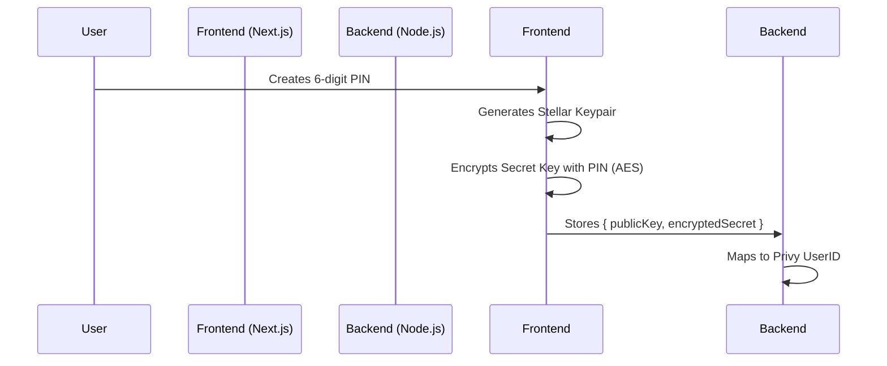

# Invisible Wallet Architecture — Vants

## Overview
Consumer-friendly "Invisible Wallet" implementation over the Stellar network. No crypto jargon (seed phrases, wallets, etc.) is exposed to the user. Security is handled via a **Payment PIN**.

## Flow Diagram

## Security Invariants
1. **Zero Secret Leak**: The raw Stellar Secret Key is never sent to the backend.
2. **Local Encryption**: Encryption happens exclusively on the client side using the user's PIN.
3. **PIN Safety**: The PIN is never stored or transmitted to the server.
4. **Backend Role**: The backend only stores the encrypted blob and the public key for identification.

## Key Components
- `frontend/lib/cryptoService.ts`: Core logic for key generation and AES encryption.
- `frontend/components/vants/PinSetup.tsx`: UX for PIN creation and confirmation.
- `backend/src/routes/accountRoutes.ts`: Secure endpoints for account status and storage.
